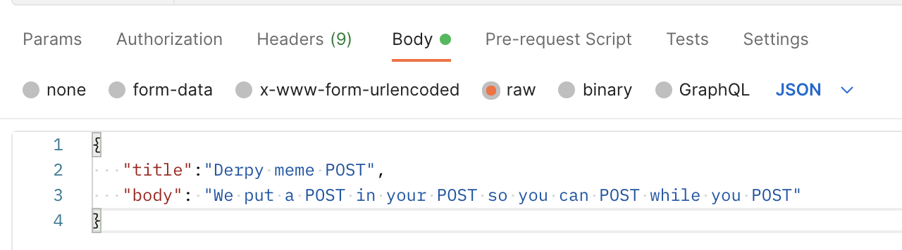
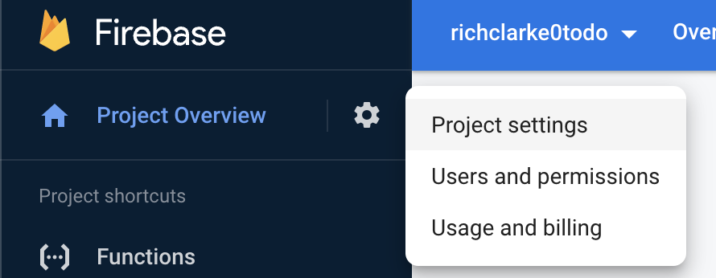

###### *Press CMD+K, then V to preview this file in a side panel in VScode.* This readme and project are based on this tutorial on [freecodecamp](https://www.freecodecamp.org):
[](https://www.freecodecamp.org/news/how-to-build-a-todo-application-using-reactjs-and-firebase/)
<hr>

# React + Firebase ToDo App


## Part 1: Let's get it started in here
First create a Firebase app, name it whatever you want.  
Then run this: 
` npm install -g firebase-tools`  
Then you probably need to `firebase login`  
And then `firebase init`  
There is now a scrolling list in your CLI, select *`Functions: Configure a Cloud Functions directory and its files`*  
Language: `JavaScript`  
Eslint: `No`  
Install dependencies: `Yes`

Paste this into `functions/index.js`:
```js
const functions = require('firebase-functions');

exports.helloWorld = functions.https.onRequest((request, response) => {
     response.send("Hello from Firebase!");
});
```  
Then: `firebase deploy`  
At this point, Google may bug you to switch from their *Spark* account to their *Blaze* account. It's pay as you go. I don't think you can continue without it but don't worry about it. You only live once, after all.

Once that's done, go to the project in your browser. Click **Build** on the left side of the screen, then click **Functions** and mouseover the function to copy the URL. You can also look in your CLI right near where it says **Deploy complete!**, there is a line just above it with a clickable Function URL.  
*Congrats, you just created something in Firebase!*

## Next part: Installing Express
`npm i express`

Now create some folders and files  
 `mkdir functions/apis`  
 `touch functions/apis/todos.js`

Remove everything from the `index.js` and then copy-paste the following code:

```js
//index.js

const functions = require('firebase-functions');
const app = require('express')();

const {
    getAllTodos
} = require('./apis/todos') // make sure this matches the case of the dir name!

app.get('/todos', getAllTodos);
exports.api = functions.https.onRequest(app);
```
Now we have a route. When a user hits the `/todos` route, it will execute the `getAllTodos` function, which we will now write into the `todos.js` file in `functions/apis/`  
```js
//todos.js

exports.getAllTodos = (req, res) => {
    todos = [
        {
            'id': '1',
            'title': 'greeting',
            'body': 'Hello world from sharvin shah' 
        },
        {
            'id': '2',
            'title': 'greeting2',
            'body': 'Hello2 world2 from sharvin shah' 
        }
    ]
    return res.json(todos);
}
```
Now you `firebase deploy`  and press `y` when the `helloWorld` prompt to `Would you like to proceed with deletion?` comes up.

## Oh Noes! An Error

```
Error: There was an error deploying functions
```

This is not very helpful. What went wrong... hmmm. I went back through the code, and noticed this first (to be clear, this is *not* the error)
```js
const app = require('express')(); //this is not the error.
```
What's with those trailing `()`'s? I don't remember seeing that before when working with MERN apps. He's... invoking it as he requires it? I don't get it. This is something to explore more later.

Anyway, before long I found the culprit. In the original tutorial, the `apis` folder is `APIs`. This case sensitivity was the problem. My folder is called
```
react-firebase-todo/functions/apis
```
but the `require` in `index.js` is...
```js
require('./APIs/todos')
```
They don't match. I changed it to:
```js
require('./apis/todos')
```
Seved, and tried 'firebase deploy' again, and got my happy little **✔  Deploy complete!**

At this point, I tried to open the URL at `https://us-central1-thenameofmytodoapp.cloudfunctions.net/api/todos` and I got a big, fat 
<hr>

## **Error: Forbidden**
### **Your client does not have permission to get URL /api/todos from this server.**
<hr>

This is what I get for using a tutorial from 2020. I searched and found this on StackOverflow:
> *it happens to me after i upgraded all NPM packages and then deployed... i delete all the functions from the cloude and re-deplyed them. it solve me this error immediately. without change permisions or any other cahnge*

Kay... go to the functions panel on the firebase dashboard of the project, click the three dots to the right of my function, click **Delete Function**. Boom, function has been deleted.  
Now, `firebase deploy`... try the URL again...
*it works!*  

  

## Let's move on

Time to create a database. In the original GIF on the tutoral, there is only one type of database. I don't know which one to pick because there are now two types, 
- Firestore Database
- Realtime Database
 
Click **Firestore Database**  
 
Create a Firestore Database with the defaults, and make sure you click **Test Mode.**

Then click **Start Collection**  

Set **Collection ID** as **todos**  

Now, add these values using this set of fields:  


You can use your current date and time.  
```js
{
    Field: title,
    Type: String,
    Value: some title
},
{
    Field: body,
    Type: String,
    Value: enter whatever you want here
},
{
    Field: createdAt,
    Type: timestamp,
    Value: Add the current date and time here
}
```
I tried to ignore **Document ID** and it wouldn't let me so I clicked **Auto-ID**.

`npm i firebase-admin`  
`mkdir functions/util`  
`touch util/admin.js`  
 ```js
 //admin.js

 const admin = require('firebase-admin');

admin.initializeApp();

const db = admin.firestore();

module.exports = { admin, db };
```
Open `todos.js`
```js
//todos.js

const { db } = require('../util/admin');

exports.getAllTodos = (request, response) => {
	db
		.collection('todos')
		.orderBy('createdAt', 'desc')
		.get()
		.then((data) => {
			let todos = [];
			data.forEach((doc) => {
				todos.push({
                    todoId: doc.id,
                    title: doc.data().title,
					body: doc.data().body,
					createdAt: doc.data().createdAt,
				});
			});
			return response.json(todos);
		})
		.catch((err) => {
			console.error(err);
			return response.status(500).json({ error: err.code});
		});
};
```

Lets unpack this a bit:

First, a little detour around **imports** since I was having a conversation around this today.
<!--  -->
- In the file `admin.js`, we are exporting two different things:  
  ```js
  module.exports = { admin, db };
  ```
- When we import from the `admin.js` file `todos.js`, we have this line:
  ```js
     const { db } = require('../util/admin');
  ```
This command with the `{ db }` essentially "pulls" the `db` function from `admin.js` by itself.


Back to the tutorial.

In the code inside `todos.js`, we have db.collection.... a bunch of stuff. It's basically telling firebase what collection it's looking in, the order of the results, and more. The code is pretty intuitive.

Now I tried the `firebase serve` command out of the tutorial. I got a warning about my node version being 18 but it still worked.

```js
//return
[
  {
    "todoId": "wlfqnutSnp7U6K2RyIxW",
    "title": "my title is here",
    "body": "here is some text",
    "createdAt": {
      "_seconds": 1659820398,
      "_nanoseconds": 665000000
    }
  }
]
```

### Now we need a "Create Todo" functionality
1. Require it in `index.js`
2. Write the method inside `todos.js`  
   
```js 
//index.js

const {
    ..,
    postOneTodo
} = require('./APIs/todos')

//don't forget this line like i did :D
app.post('/todo', postOneTodo);
```
So now, in `index.js` you have `const { getAllTodos, postOneTodo } = ...` etcetera. Destructuring the functions out of the `require`.

```js
//todos.js

exports.postOneTodo = (request, response) => {
     // i love the use of trim() here
    if (request.body.body.trim() === '') {
		return response.status(400).json({ body: 'Must not be empty' });
    }
    
    if(request.body.title.trim() === '') {
        return response.status(400).json({ title: 'Must not be empty' });
    }
    //creates a new todo object, parsing req.body and adding date()
    const newTodoItem = {
        title: request.body.title,
        body: request.body.body,
        createdAt: new Date().toISOString()
    }
    //now the actual db submission stuff
    db
        .collection('todos')
        .add(newTodoItem)
        .then((doc)=>{
            const responseTodoItem = newTodoItem;
            responseTodoItem.id = doc.id;
            return response.json(responseTodoItem);
        })
        .catch((err) => {
			response.status(500).json({ error: 'Something went wrong' });
			console.error(err);
		});
};
```

Now lets fire up Postman. Add this crap to the POST request:
```js
//remember that it is "api/todo" here, not "api/todos"
URL: http://localhost:5000/todoapp-<app-id>/<region-name>/api/todo

METHOD: POST
Text: JSON

//paste this part in
{
   "title":"Derpy meme POST",
   "body": "We put a POST in your POST so you can POST while you POST"
}
```
Make sure you set up Postman like this:  


Fire away and it should return something that looks like this:  
```js
{
    "title": "Derpy meme POST",
    "body": "We put a POST in your POST so you can POST while you POST",
    "createdAt": "2022-08-08T17:42:59.693Z",
    "id": "TEnlFOUONf54lLQLhvP0"
}
```

In the words of great American statesman John McClane, *Yippee Ki-Yay*, we just created a Todo!

### Delete Todo

The universe is infinite, but databases cost money. Thus, we need the ability to delete these todos. Let's do it.

Much like the original `create`, we have to add something to `index.js`
```js
//index.js

const {
    ..,
    deleteTodo
} = require('./APIs/todos')

//again, dont forget this part.
app.delete('/todo/:todoId', deleteTodo);
```

Now our `const {...}` in index.js should be looking a lot like this:
```js
const {
    getAllTodos,
    postOneTodo,
    deleteTodo
} = require('./apis/todos')
```
and off we go to `todos.js` and add a new method:
```js
exports.deleteTodo = (request, response) => {
    // this is really cool, .doc() is from firestore. 
    //i need to read more documentation on these commands
    const document = db.doc(`/todos/${request.params.todoId}`);
    //now lets do the manipulation of document
    document
        .get()
        .then((doc) => {
            if (!doc.exists) {
                return response.status(404).json({ error: 'Todo not found' })
            }
            return document.delete();
        })
        .then(() => {
            response.json({ message: 'Delete successful!' });
        })
        .catch((err) => {
            console.error(err);
            return response.status(500).json({ error: err.code });
        });
};
```

Call Southwest and get a direct flight to Postman. Create a DELETE and add the URL with the ID you peeled from your original todo that you created, like this:
 
 Hit send, recieve a response:  
 ```js
{
    "message": "Delete successful!"
}
```
Wow. We're really accomplishing a lot here. You should be proud. Maybe run for mayor or something.

### Edit todo

You're going to add `editTodo` to your `const` destructuring in `index.js` and add this line as well for the route
```js
// i forgot to paste this in again lol
app.put('/todo/:todoId', editTodo);
```
then hop to `todos.js` and bang this in with a hammer:
```js
exports.editTodo = ( request, response ) => { 
    //a little security, prevents manipulation of the ID or timestamp
    if(request.body.todoId || request.body.createdAt){
        response.status(403).json({message: 'Not allowed to edit todoId or createdAt fields'});
    }
    //lets get our document first
    let document = db.collection('todos').doc(`${request.params.todoId}`);
    //then push the update 
    document.update(request.body)
    .then(()=> {
        response.json({message: 'Updated successfully'});
    })
    .catch((err) => {
        console.error(err);
        return response.status(500).json({ 
                error: err.code 
        });
    });
};
```

Zoom back over to Postman. You probably need to add another todo, if you only added one originally and then deleted it to test your delete route. Once you have an existing todo, get the id from it and do this:


Response will be:  
```js
{
    "message": "Updated successfully"
}
```
And if you look up that todo, you will see the updated fields.

## Part 2: APIs

This is a multistep process:
1. User Authentication ( Login and Signup ) API.
2. GET and Update user details API.
3. Update the user profile picture API.
4. Securing the existing Todo API.

But once this is done, the lions share of the app functionality with authorization and database is finished! Word. Let's get started.

### User Authentication

Jump to Firebase in the browser, go to your project, click **Build > Authentication > Get Started**

  

Click **Email/Password** and **Enable**

Now click **Users** at the top of the screen

  
 Click **Add User** and create one.

### 1. User Login API

First install the firebase package which contains the **Firebase Auth Library**

```
npm i firebase
```  
Remember to do this in your **functions/** folder. Then `touch functions/APIs/users.js`

In `index.js` add a new `const`

```js
const {
    loginUser
} = require('./apis/users')
```
and add a new labeled section for user routes with a login route underneath it:  
```js
//users
app.post('/login', loginUser);
```
Back to the browser we go, click **Project Overview** then **+ Add App**
 and click **Web** which looks like an empty HTML tag: **</>**  

   

 Enter an app name and register. You don't need firebase hosting. It will spit you out to a screen that looks kind of intimidating, with all kinds of scary words like SDK and NPM and stuff. 
 
 Copy the object behind the `const firebaseConfig` and then click** this button:  
 

 Now `touch functions/util/config.js` and open the file up to paste in the object you just copied.
 ```js
 //config.js
module.exports = {
     apiKey: "blahblahblah",
     authDomain: "blahblahblah",
     .... and so on
}
```

If you forgot to copy it or something, you can go here:  

  

To open up the **Project Settings** panel, then just scroll down in the **General** tab (which is already selected) and you'll see it there.

Off to our nice, empty `users.js` we go to paste some new stuff:   

```js
// users.js

const { admin, db } = require('../util/admin');
const config = require('../util/config');

const firebase = require('firebase');

firebase.initializeApp(config);

const { validateLoginData, validateSignUpData } = require('../util/validators');
//we have not yet created validators.js


// Login
exports.loginUser = (request, response) => {
    const user = {
        email: request.body.email,
        password: request.body.password
    }

    const { valid, errors } = validateLoginData(user);
	if (!valid) return response.status(400).json(errors);

    firebase
        .auth()
        .signInWithEmailAndPassword(user.email, user.password)
        .then((data) => {
            return data.user.getIdToken();
        })
        .then((token) => {
            return response.json({ token });
        })
        .catch((error) => {
            console.error(error);
            return response.status(403).json({ general: 'wrong credentials, please try again'});
        })
};
```

**signInWithEmailAndPassword** checks for correct user credentials. Correct credentials return the token.

`touch functions/util/validators.js`

```js
// validators.js

//cleaned this function up a bit from the original
const isEmpty = (string) => !string.trim()

exports.validateLoginData = (data) => {
   let errors = {};
   if (isEmpty(data.email)) errors.email = 'Must not be empty';
   if (isEmpty(data.password)) errors.password = 'Must not be  empty';
   return {
       errors,
       valid: Object.keys(errors).length === 0 ? true : false
    };
};
```  
### A new problem
At this point, I should have been able to run `firebase serve` without issue, since the validators are live.

But the use of `firebase-functions` requires node v16.

```
> $ npm i firebase-functions                                                        
npm WARN EBADENGINE Unsupported engine {
npm WARN EBADENGINE   package: undefined,
npm WARN EBADENGINE   required: { node: '16' },
npm WARN EBADENGINE   current: { node: 'v18.4.0', npm: '8.12.1' }
npm WARN EBADENGINE }
```

I've never had to use NVM before, so I spent a little while messing around with it. Got it working relatively quickly. The commands 
```
nvm install node
nvm install 16
```
Got me there. You can see your installed versions with `nvm ls` and type `nvm use 16` or `nvm use 18` or any version you have installed.

I used [this guide right here](https://tecadmin.net/install-nvm-macos-with-homebrew/) and put these commands in `~/.zsh`:
```
export NVM_DIR=~/.nvm
[[ -s $HOME/.nvm/nvm.sh ]] && . $HOME/.nvm/nvm.sh
```

Now I tried running `firebase serve` and got a new error! Yay!

```
Error: Failed to load function definition from source: Failed to generate manifest from function source: Error [ERR_PACKAGE_PATH_NOT_EXPORTED]: No "exports" main defined in /Users/<project_dir>/functions/node_modules/firebase/package.json
```
Hmm.. Well, my google-fu is strong, and I found this after much searching:
1. Open `package.json`
2. Change firebase version to `^7.13.1`
3. `npm i` again.
4. Boom, `firebase serve` should be working again.

## **ANYWAY**

Alright can we continue? *Sheesh.*

Lets hop over to Postman.

Create a new request, select the method type as POST, set the body to RAW and select json:

```
URL: http://localhost:5000/todoapp-<app-id>/<region-name>/api/login

METHOD: POST

Body: {   
    "email":"your@useremail.com", 
    "password": "your_password"
}
```


Hit **Send** and you'll get a token back.

  

We're going to use it. It expires in 60 minutes. Work fast, homie.

### 2. User sign-up API

Default firebase auth only allows upi tp store info like email, pass etc. But we need more info so we know that this user owns the todos so they can CRUD the todos.

We need a new **users** collection. Under this, we will store the user's data which will be mapped to the todo based on the users username. Each username will be unique for all users on the platform.

```js
//index.js

const {
    ..,
    signUpUser
} = require('./APIs/users')

app.post('/signup', signUpUser);
```

Now go to the `validators.js` and add the following code below the `validateLoginData` method:

```js
// validators.js

const isEmail = (email) => {
	const emailRegEx = /^(([^<>()\[\]\\.,;:\s@"]+(\.[^<>()\[\]\\.,;:\s@"]+)*)|(".+"))@((\[[0-9]{1,3}\.[0-9]{1,3}\.[0-9]{1,3}\.[0-9]{1,3}\])|(([a-zA-Z\-0-9]+\.)+[a-zA-Z]{2,}))$/;
	if (email.match(emailRegEx)) return true;
	else return false;
};

exports.validateSignUpData = (data) => {
    notEmpty = 'Must not be empty'
	let errors = {};

	if (isEmpty(data.email)) {
		errors.email = notEmpty;
	} else if (!isEmail(data.email)) {
		errors.email = 'Must be a valid email address';
	}

	if (isEmpty(data.firstName)) errors.firstName = notEmpty;
	if (isEmpty(data.lastName)) errors.lastName = notEmpty;
	if (isEmpty(data.phoneNumber)) errors.phoneNumber = notEmpty;
	if (isEmpty(data.country)) errors.country = notEmpty;

	if (isEmpty(data.password)) errors.password = notEmpty;
	if (data.password !== data.confirmPassword) errors.confirmPassword = 'Passwords must match';
	if (isEmpty(data.username)) errors.username = notEmpty;

	return {
		errors,
		valid: Object.keys(errors).length === 0 ? true : false
	};
};
```